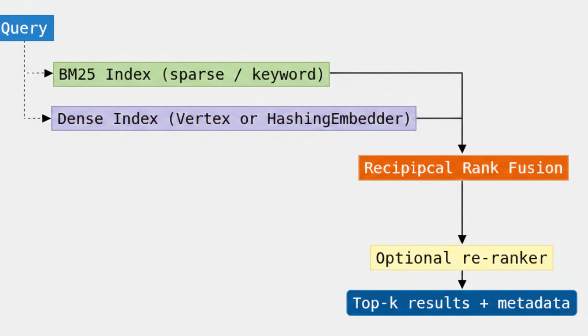

# Lab 1.2 – Hybrid Retrieval + Custom Re-ranker Pipeline

[](https://colab.research.google.com/github/fischer3-net/accurate_secure_rag_systems/blob/main/labs/01-chunking/notebooks/lab-1.2-hybrid-rerank.ipynb)
[](https://github.com/fischer3-net/accurate_secure_rag_systems/blob/main/labs/01-chunking/notebooks/lab-1.2-hybrid-rerank.ipynb)

*Run in the browser with [Google Colab](../resources/colab.md) or locally via [Docker](../resources/docker.md) / [VS Code](../resources/vscode.md).*

**Objective:** Build a hybrid retrieval stack (dense + sparse) with Reciprocal Rank Fusion (RRF) and a lightweight re-ranking stage that measurably improves top-3 precision for DFD security policy checks.

This lab consumes the enriched corpus produced by Lab 1.1 and turns it into a production-ready retrieval component that later modules and the Capstone will call.

---

## Learning Goals

By completing this lab you will be able to:

- Implement BM25 (sparse) retrieval that excels at exact control IDs and rare technical terms.
- Combine dense semantic search with sparse keyword search via **Reciprocal Rank Fusion**.
- Apply metadata pre-filters (asset_type, risk_tier, sdlc_phase, …) before or after fusion.
- Add a deterministic, auditable re-ranker that boosts exact control-ID and phrase matches.
- Measure precision@3 against a held-out set of DFD-related evaluation queries and demonstrate lift over a pure vector baseline.

---

## Prerequisites

- Completed Lab 1.1 (enriched corpus available as JSONL or BigQuery table).
- Python 3.11+ environment.
- Optional but recommended: GCP project with Vertex AI API enabled (for real embeddings).

Install any missing packages:

```bash
pip install -r labs/01-chunking/requirements.txt
```

---

## Architecture Overview




**Why hybrid?**

| Signal | Strength for this domain |
|--------|---------------------------|
| Dense (embeddings) | Semantic paraphrases (“unprotected flows across trust boundaries”) |
| Sparse (BM25) | Exact control IDs (`SEC-DFD-014`), rare asset names, regulatory language |
| RRF | Robust fusion without needing score calibration |
| Re-ranker | Final precision boost using domain-specific signals |

---

## Starter Location

```
labs/01-chunking/
├── src/
│   ├── retrieval.py          # HybridRetriever, BM25, RRF, re-ranker, eval helpers
│   ├── chunking.py           # (from Lab 1.1)
│   ├── metadata.py
│   └── ingest.py
├── data/
│   ├── sdlc_handbook.md
│   ├── security_baseline.md
│   └── evaluation_queries.json   # 12 DFD / security queries + ground truth
├── notebooks/
│   └── lab-1.2-hybrid-rerank.ipynb
└── tests/
    └── test_retrieval.py
```

A complete reference implementation is already present. Your job is to run it, understand the moving parts, measure the precision lift, and optionally extend the re-ranker or swap in Vertex AI embeddings / Ranking API.

---

## Step-by-Step Instructions

### 1. Ensure the Lab 1.1 corpus exists

```python
from src.chunking import process_directory
from src.ingest import write_jsonl

corpus = process_directory("data")
write_jsonl(corpus, "output/rag_chunks.jsonl")
```

### 2. Explore the evaluation queries

Open `data/evaluation_queries.json`. Each entry contains:

- a realistic natural-language (or keyword) query a security architect might ask,
- the expected `control_id`(s) that should appear in the top results,
- optional asset-type hints.

These queries form the ground-truth set for precision@3 measurement.

### 3. Run the hybrid retriever

```python
from src.retrieval import HybridRetriever, HashingEmbedder

retriever = HybridRetriever.from_jsonl(
    "output/rag_chunks.jsonl",
    embedder=HashingEmbedder(),   # swap for VertexEmbedder when credentials exist
)

result = retriever.retrieve(
    "Can an external entity write directly to an internal data store?",
    top_k=3,
)
for hit in result.final_hits:
    print(hit.rank, hit.control_id, hit.score, hit.record.section[:60])
```

### 4. Compare retrieval modes

The notebook and evaluation harness let you toggle:

| Mode | Flags |
|------|-------|
| BM25 only | `use_dense=False, use_rerank=False` |
| Dense only | `use_bm25=False, use_rerank=False` |
| Hybrid (RRF) | `use_rerank=False` |
| Hybrid + re-rank | default |

Record precision@3 for each mode. You should observe a clear lift from hybrid + re-rank over pure dense or pure sparse on the provided query set.

### 5. Apply metadata filters

```python
result = retriever.retrieve(
    "trust boundary controls",
    top_k=5,
    asset_type="trust_boundary",
    risk_tier=["critical", "high"],
)
```

Filtering before fusion is especially useful when the user has already narrowed the question to a particular asset type or risk tier (common in interactive DFD review tools).

### 6. (Optional) Switch to real Vertex AI embeddings

```python
from src.retrieval import VertexEmbedder, HybridRetriever

embedder = VertexEmbedder(project_id="YOUR_PROJECT")
retriever = HybridRetriever.from_jsonl(
    "output/rag_chunks.jsonl",
    embedder=embedder,
)
```

### 7. Run the automated evaluation

```python
from src.retrieval import load_eval_queries, evaluate_retriever

queries = load_eval_queries("data/evaluation_queries.json")
metrics = evaluate_retriever(retriever, queries, k=3)
print(metrics["mean_precision_at_3"])
```

---

## Reciprocal Rank Fusion (reference)

\[
\text{score}(d) = \sum_{r \in R} \frac{1}{k + \text{rank}_r(d)}
\]

where \(k = 60\) (the conventional constant) and \(\text{rank}_r(d)\) is the 1-based rank of document \(d\) in ranked list \(r\). RRF needs no score normalisation and is robust when the underlying retrievers produce incomparable score ranges.

---

## Success Criteria

| Criterion | Target |
|-----------|--------|
| Hybrid mean hit-rate@3 | ≥ 0.80 on the supplied evaluation set (HashingEmbedder) |
| Clear lift vs. single-signal baselines | Documented in notebook (hit-rate and precision) |
| Metadata filters work correctly | Filtered results respect the requested fields |
| Code is reusable | `HybridRetriever` can be imported by later labs / Capstone |
| Offline path works | Tests and notebook run without GCP credentials |

---

## Validation Checklist

- [ ] Corpus from Lab 1.1 loads successfully
- [ ] BM25 returns relevant control IDs for keyword queries
- [ ] RRF fusion produces a sensible combined ranking
- [ ] Re-ranker improves or preserves precision@3
- [ ] `evaluate_retriever` reports mean precision@3
- [ ] Metadata filters restrict results as expected
- [ ] Unit tests pass (`pytest tests/test_retrieval.py -v`)

---

## Submission

1. Push your notebook (with recorded metrics) and any extensions to a branch or fork.
2. Submit the GitHub link via the Moodle Lab 1.2 assignment activity.
3. Include a short note describing:
   - precision@3 for BM25-only / dense-only / hybrid / hybrid+rerank
   - any changes you made to the re-ranker or fusion parameters
   - observations about when sparse signals dominate vs. dense signals

---

## Tips for Security-Focused Practitioners

- Prefer deterministic re-rankers (or at least log the signals they use) when the output will feed a compliance decision.
- Always keep the original source section and control_id on every returned hit — the Capstone report depends on them.
- Metadata filters are a cheap and powerful way to reduce the candidate set before expensive re-ranking or LLM calls.
- When you later move the index to Vertex AI Vector Search or AlloyDB pgvector, the same `HybridRetriever` interface can stay; only the dense backend changes.

**Next:** Week 2 will explore where to *store* this corpus at scale (Vertex AI Vector Search, AlloyDB pgvector, BigQuery, Graph) and the latency / cost / accuracy trade-offs of each option.
