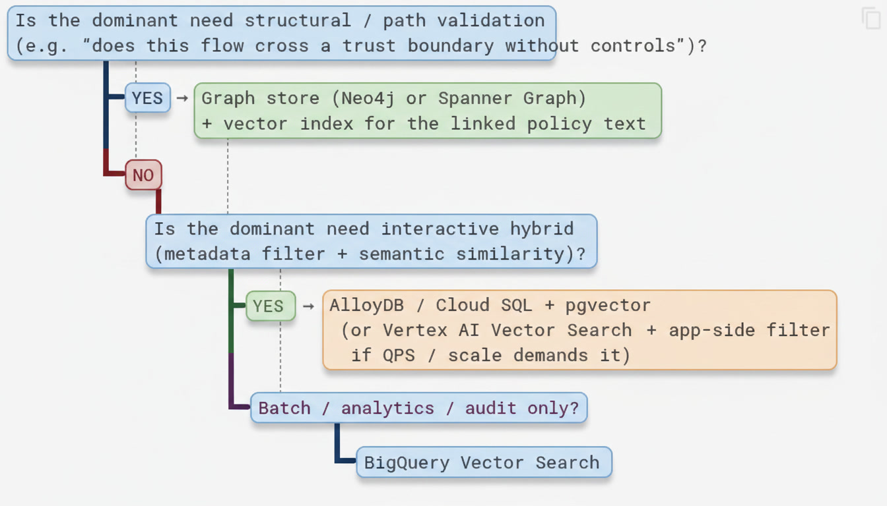

# Week 2 Theory – Storage Architecture on Google Cloud Platform

**Focus:** Choosing the right place to store and query the enriched compliance corpus so that DFD security evaluation is fast, accurate, and operationally sustainable.

Welcome to Week 2. Last week you did the hard foundational work: you turned raw policy documents into clean, metadata-rich chunks with Parent-Child relationships and a consistent compliance schema. That corpus is now ready to be *queried*. The question this week is deceptively simple:

> Where should those chunks live, and how should we retrieve them?

In a workshop setting the answer feels academic. In a real security architecture review workflow the answer determines whether an interactive tool feels responsive, whether you can prove which version of a control was used on a given date, and whether the system remains affordable six months later when the control library has grown by an order of magnitude.

This week is about making that decision deliberately rather than by habit or by whatever the last conference talk recommended.

---

## 1. Why Storage Choice Matters for Compliance RAG

In Week 1 you built a high-quality, metadata-rich corpus of SDLC and security-baseline chunks. That corpus is currently small enough to live in memory or in a simple JSONL file. A production DFD compliance system will not stay that way. It will grow to include:

- Hundreds of policy documents and control libraries (and multiple versions of each)
- Thousands of historical DFD evaluations and the decisions that were made against them
- Continuous updates as baselines, regulatory mappings, and internal standards change

The storage layer is no longer a neutral “persistence” concern. It directly shapes the capabilities you can offer:

| Concern              | Impact on DFD compliance                                                                 |
|----------------------|-------------------------------------------------------------------------------------------|
| **Latency**          | Interactive review tools need sub-second answers; security architects will not wait       |
| **Hybrid filtering** | “Show only *critical* trust-boundary controls in the *Design* phase” is a SQL + vector query |
| **Structural queries**| “Does any data flow from External Entity X reach Data Store Y without crossing an authenticated process?” is a *graph* query |
| **Cost & ops**       | Workshop budgets vs. production budgets; who patches the database and when?               |
| **Auditability**     | Can you prove which version of a control was retrieved on a given date for an audit?      |

No single GCP product wins on every axis. The skill is matching the **dominant query pattern** of your use case to the right engine—or, more commonly, to a thoughtful combination of engines.

---

## 2. Deconstructing the GCP Options

### 2.1 Vertex AI Vector Search (Matching Engine)

Vertex AI Vector Search is Google’s managed approximate nearest-neighbour (ANN) service. It is purpose-built for high-QPS, low-latency semantic retrieval at scales that most relational databases struggle with.

**Strengths**
- Extremely low latency even at hundreds of millions or billions of vectors
- Automatic sharding and scaling
- Tight integration with Vertex AI embeddings and the Ranking API
- You can attach a limited set of restrict tokens (metadata filters) at index time

**Weaknesses**
- Metadata filtering is far more limited than a full relational store
- Cost is driven by index size + query volume; it can become expensive for corpora that are still modest
- Overkill if your entire working set fits comfortably in a well-tuned PostgreSQL instance

**Best when:** You need pure (or lightly restricted) semantic search at high query rates and you are willing to push more complex filtering into application code or a secondary store.

### 2.2 AlloyDB / Cloud SQL with `pgvector`

This is PostgreSQL (AlloyDB is Google’s high-performance PostgreSQL-compatible service) with the `pgvector` extension. Vectors live *inside* the same database that holds your structured metadata, which changes the query model completely.

**Strengths**
- True hybrid queries in a single statement:  
  `WHERE risk_tier = 'critical' AND sdlc_phase = 'design' ORDER BY embedding <=> $1`
- Transactional consistency, familiar SQL tooling, Point-in-Time recovery, and easy auditing
- You can keep Parent-Child relationships as ordinary foreign keys
- Excellent fit for the metadata-rich corpus you built in Week 1

**Weaknesses**
- You (or your platform team) manage instance sizing, vacuuming, and index maintenance
- ANN performance is good, but it is not in the same league as Matching Engine once you reach tens or hundreds of millions of vectors under tight latency SLOs

**Best when:** The majority of queries combine structured filters (control_id, asset_type, sdlc_phase, risk_tier, etc.) with semantic similarity—the exact pattern of most DFD policy lookups.

### 2.3 BigQuery Vector Search

BigQuery treats vector similarity as just another SQL function. That makes it extraordinarily convenient for analytic workloads.

**Strengths**
- Fully serverless; no capacity planning
- Excellent for joining retrieved chunks against large historical evaluation logs, audit tables, or cost data
- Cost is scan-based and predictable for batch jobs

**Weaknesses**
- Latency is higher than online serving stores; it is rarely the right choice for an interactive “type a question, get an answer” experience
- Not designed for high-QPS transactional access patterns

**Best when:** Offline evaluation (Week 4), audit reporting, nightly re-scoring of the entire corpus, or joining retrieval results with large analytic tables.

### 2.4 Knowledge Graphs (Neo4j on GKE / Aura, or Spanner Graph)

A Data Flow Diagram is fundamentally a graph: Processes, Data Stores, External Entities, Data Flows, and Trust Boundaries. Vector search is excellent at finding *similar policy language*; it is almost useless at answering *path* questions.

**Strengths**
- Native model for DFD topology
- Path queries (“is there an unauthenticated path from External Entity X to Data Store Y that crosses a trust boundary?”) become first-class
- You can attach policy chunk IDs or control IDs as properties or edges, creating a natural Graph-Augmented RAG pattern

**Weaknesses**
- Operational overhead is higher than a managed relational or pure vector service
- Vector search is secondary; most teams end up dual-writing or maintaining a separate vector index for the policy text

**Best when:** You must validate *connectivity* and *trust-boundary crossings*, not only “which policy text is similar to this question.” Lab 2.2 explores exactly this pattern.

---

## 3. Architectural Trade-off Matrix

| Dimension                    | Vertex AI Vector Search | AlloyDB + pgvector      | BigQuery Vector     | Graph (Neo4j / Spanner Graph) |
|-----------------------------|-------------------------|-------------------------|---------------------|-------------------------------|
| **p50 latency (online)**    | Extremely low           | Low–medium              | Higher              | Medium                        |
| **Hybrid SQL + vector**     | Limited                 | **Native**              | Strong              | Limited                       |
| **Graph / path queries**    | No                      | Limited                 | No                  | **Native**                    |
| **Scale (vectors)**         | Billions                | Millions (practical)    | Billions (batch)    | Millions of nodes/edges       |
| **Cost model**              | Index + query units     | Instance + storage      | Scan / slot         | Instance + storage            |
| **Ops complexity**          | Low (managed)           | Medium                  | Low                 | Higher                        |
| **Transactional updates**   | Eventual                | Strong                  | Append-oriented     | Strong                        |
| **Audit / versioning**      | Application-level       | Easy (tables + history) | Excellent           | Application-level             |

Use this matrix as a decision aid, not a scorecard. Real systems almost always combine two or more of these engines.

---

## 4. Decision Guidance for the DFD Compliance Use Case

A useful way to decide is to start from the dominant query pattern rather than from product preference:

**Practical hybrid pattern used in many production systems (and in the Capstone):**

1. **AlloyDB (or Cloud SQL) + pgvector** as the system of record for chunks + metadata. This gives you strong hybrid filtering, Parent-Child joins, and straightforward auditing.
2. Optional **Vertex AI Vector Search** replica for ultra-low-latency pure semantic endpoints when QPS or scale requires it.
3. Optional **graph overlay** (Neo4j / Spanner Graph) for DFD topology, with edges that point back to chunk IDs in the relational/vector store.

This layered approach lets you start simple (Lab 2.1) and add structural power only where the use case demands it (Lab 2.2).

---

## 5. Mapping Week 1 Artifacts to Storage

| Week 1 artefact                          | Natural home                                      |
|------------------------------------------|---------------------------------------------------|
| Enriched chunks (`ChunkRecord`)          | AlloyDB table or Vertex AI index documents        |
| Metadata filters (asset_type, risk_tier, …) | SQL `WHERE` clauses or Vertex restrict tokens   |
| Parent–Child links                       | Self-referential foreign key or graph edge        |
| Evaluation queries                       | BigQuery table for offline scoring                |
| DFD topology (Lab 2.2)                   | Graph nodes + edges                               |

The abstraction you implement in Lab 2.1 (a common store interface) is deliberately designed so that later labs and the Capstone can swap implementations without rewriting the retrieval logic that sits above them.

---

## 6. Key Takeaways

- Storage is a **query-pattern** decision, not a popularity contest.
- For DFD security evaluation the two most valuable capabilities are **hybrid SQL + vector** (AlloyDB / pgvector) and **path / connectivity queries** (graph).
- Vertex AI Vector Search shines when pure semantic latency at scale is the bottleneck.
- BigQuery is the natural home for evaluation, audit, and batch re-scoring.
- Most production systems end up with a hybrid architecture rather than a single engine.
- The Capstone will ask you to justify and implement at least one of these hybrid patterns with evidence from the benchmarks you run this week.

**Next:** Lab 2.1 benchmarks an AlloyDB-style hybrid retrieval path against a Vector Search-style pure semantic path on the same corpus. Lab 2.2 adds the graph layer so you can answer structural questions that pure vector search cannot.

---

## Addendum: Mathematical Foundations (Completely OPTIONAL)

A few core formulas help make the trade-offs concrete. All of them are supported by the MathJax configuration already active on this site.

### A.1 Vector Similarity Metrics

Most vector stores (including `pgvector` and Vertex AI Vector Search) support one or more of the following distance / similarity functions. For unit-normalised embeddings the relationships are especially clean.

**Cosine similarity**

\[
\text{sim}_{\cos}(\mathbf{u}, \mathbf{v}) = \frac{\mathbf{u} \cdot \mathbf{v}}{\|\mathbf{u}\| \|\mathbf{v}\|}
\]

When both vectors are L2-normalised this reduces to a simple inner product:

\[
\text{sim}_{\cos}(\mathbf{u}, \mathbf{v}) = \mathbf{u} \cdot \mathbf{v}
\]

**Euclidean (L2) distance**

\[
d_{L2}(\mathbf{u}, \mathbf{v}) = \|\mathbf{u} - \mathbf{v}\|_2 = \sqrt{\sum_i (u_i - v_i)^2}
\]

**Inner product** (frequently used directly by ANN indexes)

\[
\text{IP}(\mathbf{u}, \mathbf{v}) = \mathbf{u} \cdot \mathbf{v}
\]

In `pgvector` the operators you will see most often are:

| Operator | Meaning                          |
|----------|----------------------------------|
| `<=>`    | Cosine distance                  |
| `<->`    | Euclidean (L2) distance          |
| `<#>`    | Negative inner product           |

### A.2 Approximate vs Exact Nearest Neighbour

Exact nearest-neighbour search over \(n\) vectors in dimension \(d\) is \(O(nd)\) per query. Approximate methods (HNSW, IVF, ScaNN, etc.) trade a small amount of recall for orders-of-magnitude lower latency. Vertex AI Vector Search is an ANN service; `pgvector` can be configured for either exact or approximate search depending on the index type you create.

### A.3 Hybrid Retrieval and Rank Fusion

When you combine a dense (semantic) ranked list with a sparse (BM25 / keyword) ranked list you need a way to merge them. Reciprocal Rank Fusion (already introduced in Week 1) is deliberately simple and robust:

\[
\text{score}_{\text{RRF}}(d) = \sum_{r \in R} \frac{1}{k + \text{rank}_r(d)}
\]

where \(k = 60\) is the conventional constant and \(\text{rank}_r(d)\) is the 1-based rank of document \(d\) in ranked list \(r\).

A weighted linear combination is also common when you have calibrated scores:

\[
\text{score}_{\text{hybrid}}(d) = \alpha \cdot \text{sim}_{\text{dense}}(d) + (1 - \alpha) \cdot \text{sim}_{\text{sparse}}(d)
\]

In practice, RRF is often preferred for compliance workloads because it requires no score normalisation and remains stable when the underlying retrievers produce incomparable numeric ranges.

### A.4 Why Hybrid Filtering Matters Mathematically

A pure vector query returns the \(k\) nearest neighbours under a chosen metric. Adding structured predicates changes the problem to a *constrained* nearest-neighbour search:

\[
\arg\max_{d \in D'} \text{sim}(q, d)
\quad\text{where}\quad
D' = \{ d \in D \mid \text{risk\_tier}(d) = \text{critical} \land \text{sdlc\_phase}(d) = \text{design} \}
\]

Engines that can apply the predicate *before* or *during* the vector search (AlloyDB / pgvector, BigQuery) avoid materialising a large candidate set only to discard most of it in application code. That difference is often the dominant factor in both latency and cost for metadata-rich compliance corpora.
